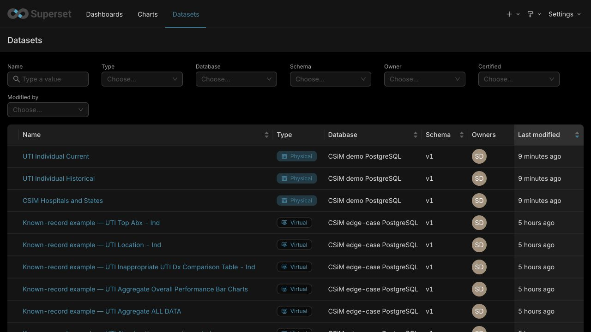

# Beth's three requested changes

September 16, 2026. Target: the [official Superset 6.1.0 dashboard](https://standard.csim.uwdigi.org/superset/dashboard/csim-individual-standard-month-selectors/).

| Request | Current result | Remaining work |
| --- | --- | --- |
| Yao's accessible colors | All 109 original label-to-color assignments match the April export in the public dashboard. Existing rendered-color checks also cover hospital/comparison legend names. | Recheck any legends Beth changes before the final release. |
| Production dataset names | All six reporting names match production. The three existing demo upload sources are now registered with the production names and reflected identifier columns. | Exclude the separate examples and retired objects from the client update. Test an update over the client's existing identities. |
| Identify the contributing submissions | Both source tables have record IDs; Current also has a repeat instance. | Build a separate record-verification table and CSV, with exact membership and measure-contribution checks. This is not implemented yet. |

## Record verification: the next substantive change

Keep the summary dataset at its existing level of aggregation. A separate saved
view should show each contributing submission, its source (Current or
Historical), record ID, and repeat instance where present. Historical rows have
no repeat instance. IDs must retain their source context; their uniqueness must
be checked rather than assumed.

Use the same hospital/cohort, observation dates, location and eligibility rules
as the summary. For a rate, distinguish which rows count toward its numerator
and denominator. Preserve the existing cohort weighting. Missing calendar rows
have no underlying submissions.

Acceptance: for agreed examples, the listed submissions reproduce the summary
counts and measures, repeat instances remain distinct, CSV contents are complete,
and the dashboard measures do not change. A direct chart-to-record link must be
verified in stock 6.1.0 before it is promised. The existing ALL DATA download
contains summary rows and does not provide this record-level view.

## Other work, in order

1. Preserve and reconcile Beth's saved edits, then produce one clean client
   package. Rehearse import twice against the client's existing object identities
   without duplicates, connection changes or changes to uploaded data.
2. Repair or clearly retain the known left-sidebar **Clear all / reselect**
   limitation. It is separate from these three requests and still needs a passing
   same-page recovery test on official 6.1.0.
3. Resolve team-dependent questions separately: approved hospital transition
   rules and the source of the older expected total of 500. The observed full
   Hospital 53 range sums to 980; the saved shorter range sums to 269.

## Checks for the source registrations

The registration command created exactly three physical dataset entries. A
repeat local run created none. Existing dashboard, chart and dataset definitions
were compared before and after and remained unchanged. A local browser regression
verified names, physical types and identifier columns; its screenshot was inspected.
The public command confirmed the same registrations and unchanged definitions.
The existing public demo viewer also sees all three Physical datasets after the
approved read-access update. The public screenshot was inspected. No editing or
upload permissions were added.

The [local administrator screenshot](../design/evidence/beth-review/client-upload-sources-local.png)
shows the same three source names alongside the six reporting names. These checks
cover source registration, not record-level verification or final client acceptance.
The local browser regression passed without video; CI was not verified for this change.
